### Part 1. Настройка 

**== Задание ==**

##### Поднять виртуальную машину *Ubuntu Server 20.04 LTS*

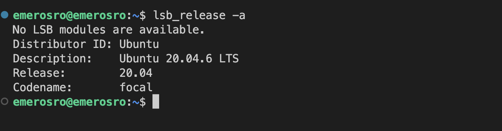

##### Скачать и установить на виртуальную машину **gitlab-runner**

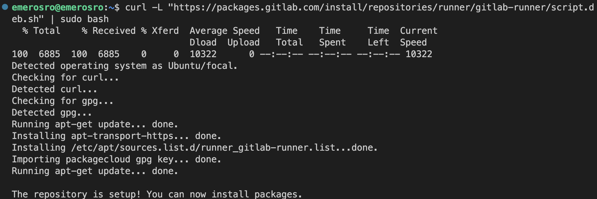

##### Запустить **gitlab-runner** и зарегистрировать его для использования в текущем проекте (*DO6_CICD*)

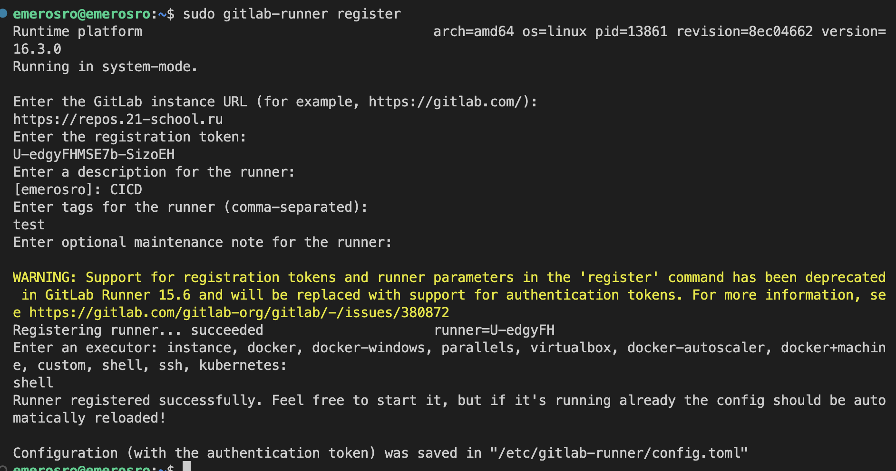

## Part 2. Сборка

**== Задание ==**

#### Написать этап для **CI** по сборке приложений из проекта *C2_SimpleBashUtils*:
##### В файле _gitlab-ci.yml_ добавить этап запуска сборки через мейк файл из проекта _C2_

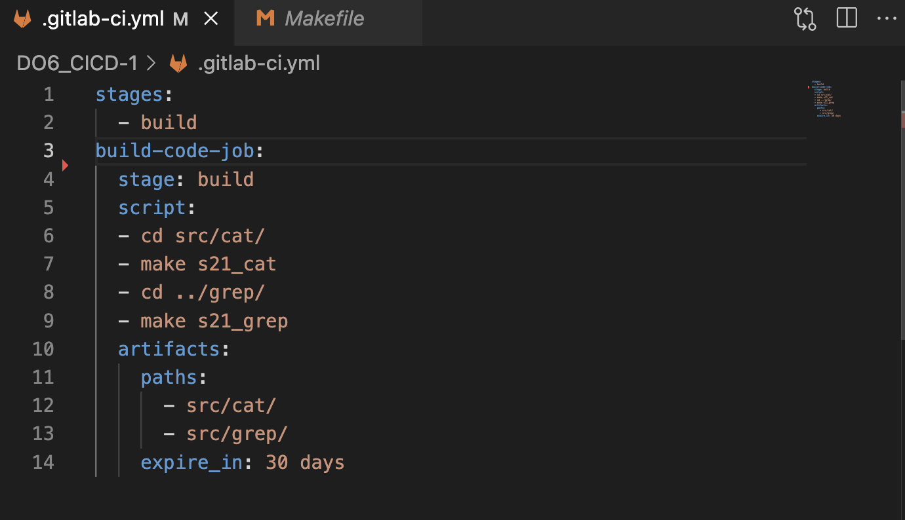

##### Файлы, полученные после сборки (артефакты), сохранять в произвольную директорию со сроком хранения 30 дней.

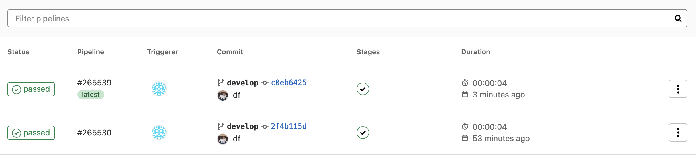

### Part 3. Тест кодстайла

**== Задание ==**

#### Написать этап для **CI**, который запускает скрипт кодстайла (*clang-format*):

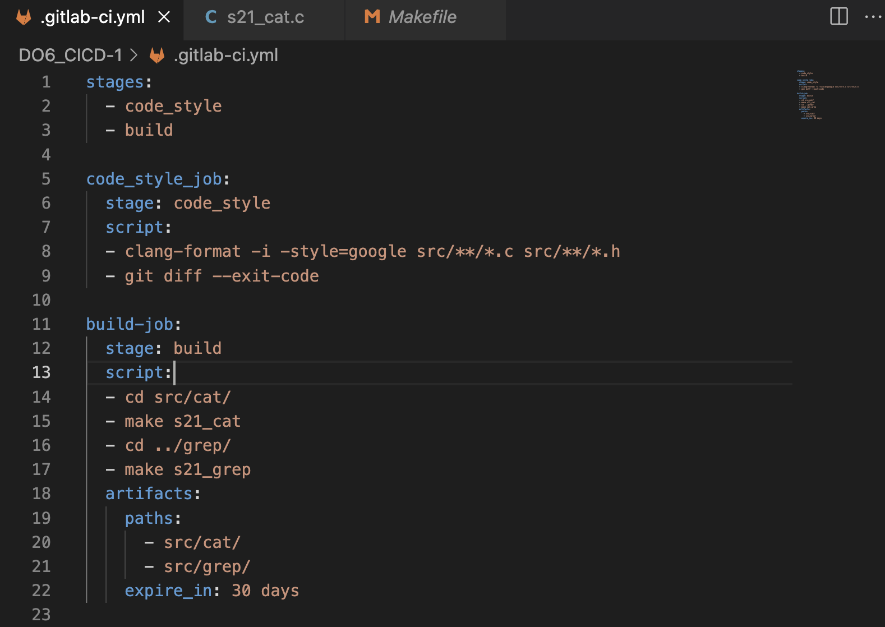

##### Если кодстайл не прошел, то "зафейлить" пайплайн

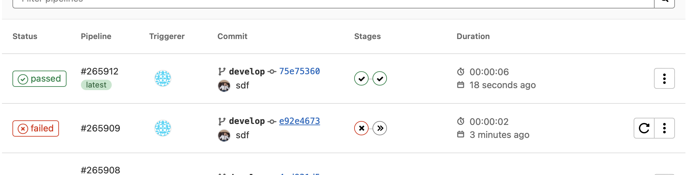

##### В пайплайне отобразить вывод утилиты *clang-format*

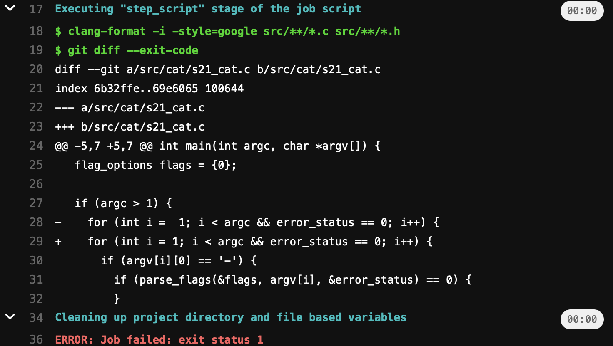

### Part 4. Интеграционные тесты

**== Задание ==**

#### Написать этап для **CI**, который запускает ваши интеграционные тесты из того же проекта:

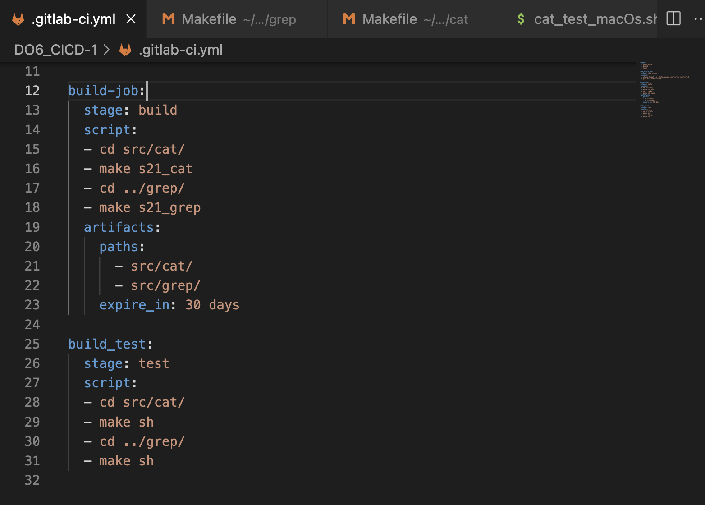

##### Запускать этот этап автоматически только при условии, если сборка и тест кодстайла прошли успешно. Если тесты не прошли, то "зафейлить" пайплайн

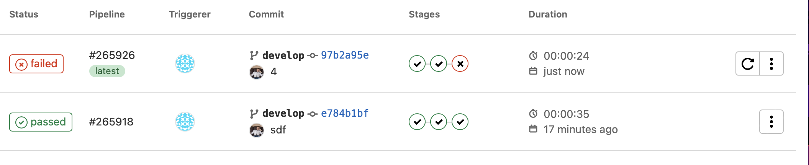

##### В пайплайне отобразить вывод, что интеграционные тесты успешно прошли / провалились

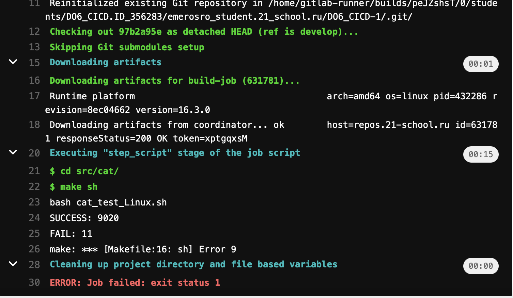

### Part 5. Этап деплоя

**== Задание ==**

#### Написать этап для **CD**, который "разворачивает" проект на другой виртуальной машине:

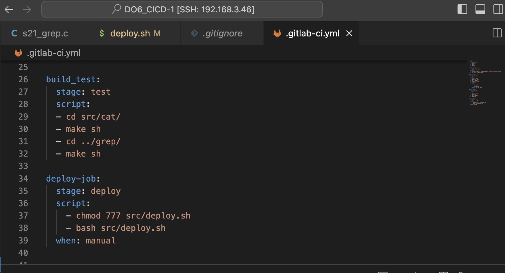

##### Написать bash-скрипт, который при помощи **ssh** и **scp** копирует файлы, полученные после сборки (артефакты), в директорию */usr/local/bin* второй виртуальной машины

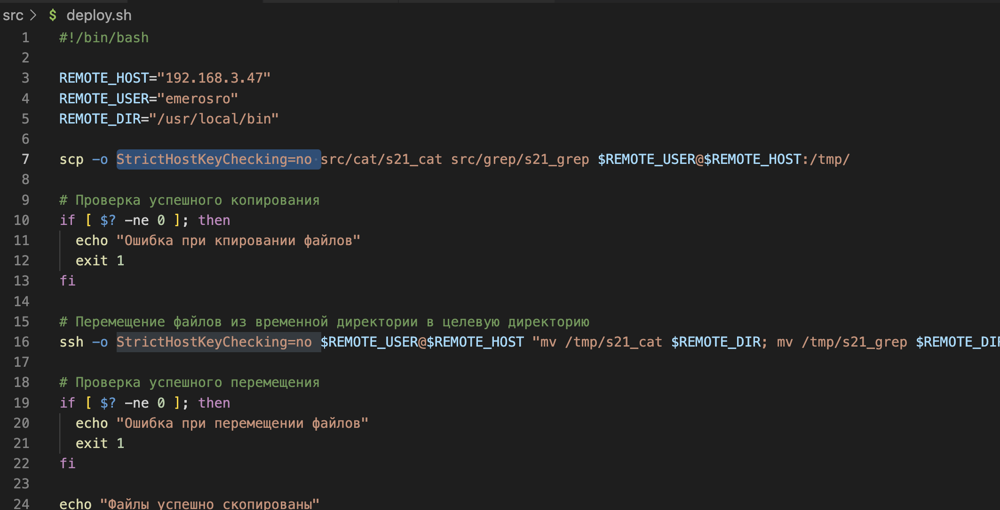

- Для выполненения этого этапа нужно сначала скопировать ключ на вторую машину , чтобы можно было подключаться без ввода пароля

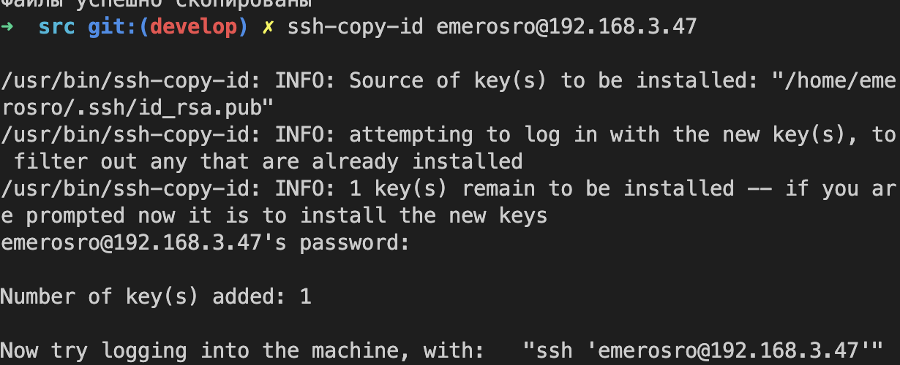

- Cкопировать ключи из домашнего каталога в каталог пользователя гитлаб ранер, так как ранер с gitlab запускает все файлы используя пользователя gitlab-runner **sudo cp -r /home/emerosro/.ssh /home/gitlab-runner/**

- Изменить владельца и группу для каталога .ssh в домашнем каталоге gitlab-runner **sudo chown -R gitlab-runner:gitlab-runner /home/gitlab-runner/.ssh**

##### В случае ошибки "зафейлить" пайплайн

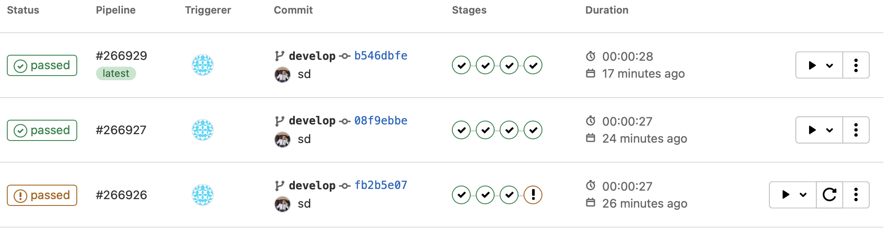

### Part 6. Дополнительно. Уведомления

**== Задание ==**

##### Настроить уведомления о успешном/неуспешном выполнении пайплайна через бота с именем "[ваш nickname] DO6 CI/CD" в *Telegram*

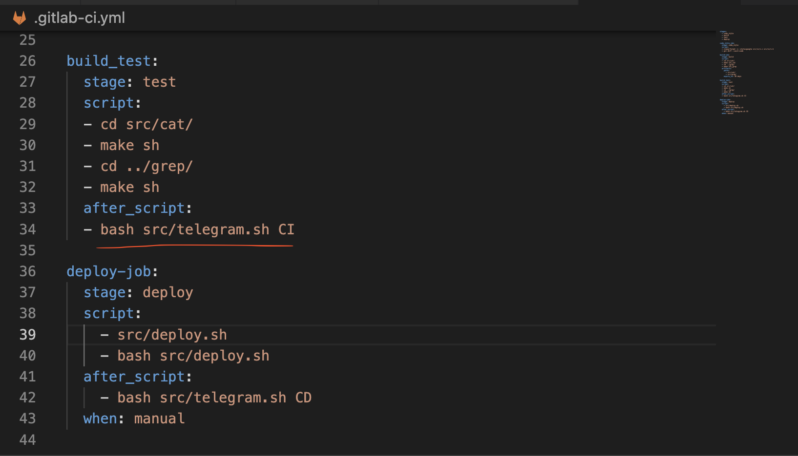

- Текст уведомления должен содержать информацию об успешности прохождения как этапа **CI**, так и этапа **CD**.

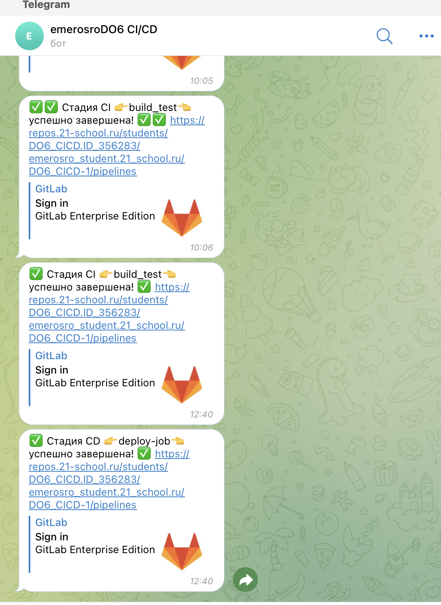
